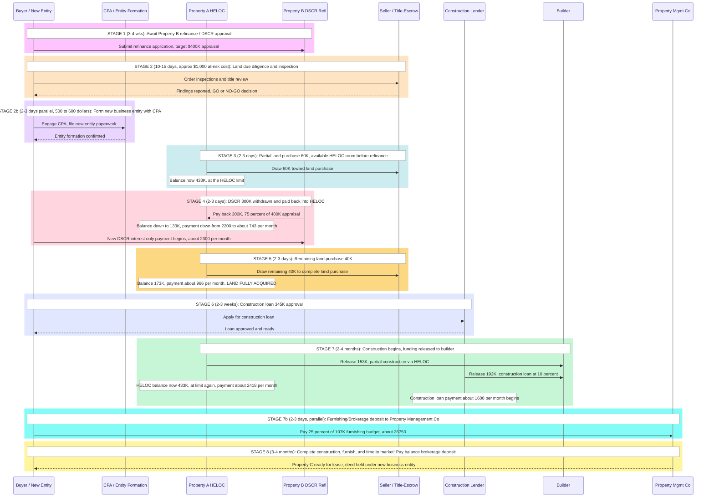

```mermaid
%%{
  init: {

  "theme": "base",
  "themeVariables": {
    "fontFamily": "Helvetica, Arial, sans-serif",
    "fontSize": "15px",
    "actorBkg": "#EEEDFE",
    "actorBorder": "#534AB7",
    "actorTextColor": "#26215C",
    "actorLineColor": "#888780",
    "signalColor": "#2C2C2A",
    "signalTextColor": "#2C2C2A",
    "noteBkgColor": "#FFFFFF",
    "noteTextColor": "#2C2C2A",
    "noteBorderColor": "#999999",
    "loopTextColor": "#26215C",
    "labelBoxBkgColor": "#EEEDFE",
    "labelBoxBorderColor": "#534AB7",
    "labelTextColor": "#26215C",
    "sequenceNumberColor": "#ffffff"
  }
}
}%%

sequenceDiagram
  participant BUY as Buyer / New Entity
  participant CPA as CPA / Entity Formation
  participant HELOC as Property A HELOC
  participant DSCR as Property B DSCR Refi
  participant SELL as Seller / Title-Escrow
  participant CL as Construction Lender
  participant BLD as Builder
  participant PM as Property Mgmt Co

  rect rgb(253, 196, 255)
  note over BUY,DSCR: STAGE 1 (3-4 wks): Await Property B refinance / DSCR approval
  BUY->>DSCR: Submit refinance application, target $400K appraisal
  end

  rect rgb(255,228,196)
  note over BUY,SELL: STAGE 2 (10-15 days, approx $1,000 at-risk cost): Land due diligence and inspection
  BUY->>SELL: Order inspections and title review
  SELL-->>BUY: Findings reported, GO or NO-GO decision
  end

  rect rgb(233,213,255)
  note over BUY,CPA: STAGE 2b (2-3 days parallel, 500 to 600 dollars): Form new business entity with CPA
  BUY->>CPA: Engage CPA, file new entity paperwork
  CPA-->>BUY: Entity formation confirmed
  end

  rect rgb(204,236,239)
  note over HELOC,SELL: STAGE 3 (2-3 days): Partial land purchase 60K, available HELOC room before refinance
  HELOC->>SELL: Draw 60K toward land purchase
  note over HELOC: Balance now 433K, at the HELOC limit
  end

  rect rgb(255,214,224)
  note over DSCR,HELOC: STAGE 4 (2-3 days): DSCR 300K withdrawn and paid back into HELOC
  DSCR->>HELOC: Pay back 300K, 75 percent of 400K appraisal
  note over HELOC: Balance down to 133K, payment down from 2200 to about 743 per month
  BUY->>DSCR: New DSCR interest only payment begins, about 2300 per month
  end

  rect rgb(252, 216, 131)
  note over HELOC,SELL: STAGE 5 (2-3 days): Remaining land purchase 40K
  HELOC->>SELL: Draw remaining 40K to complete land purchase
  note over HELOC: Balance 173K, payment about 966 per month. LAND FULLY ACQUIRED
  end

  rect rgb(224,231,255)
  note over BUY,CL: STAGE 6 (2-3 weeks): Construction loan 345K approval
  BUY->>CL: Apply for construction loan
  CL-->>BUY: Loan approved and ready
  end

  rect rgb(198,246,213)
  note over HELOC,BLD: STAGE 7 (2-4 months): Construction begins, funding released to builder
  HELOC->>BLD: Release 153K, partial construction via HELOC
  CL->>BLD: Release 192K, construction loan at 10 percent
  note over HELOC: HELOC balance now 433K, at limit again, payment about 2418 per month
  note over CL: Construction loan payment about 1600 per month begins
  end

  rect rgb(131, 252, 248)
  note over BUY,PM: STAGE 7b (2-3 days, parallel): Furnishing/Brokerage deposit to Property Management Co
  BUY->>PM: Pay 25 percent of 107K furnishing budget, about 26750
  end

  rect rgb(255,245,157)
  note over BUY,PM: STAGE 8 (3-4 months): Complete construction, furnish, and time to market: Pay balance brokerage deposit
  PM-->>BUY: Property C ready for lease, deed held under new business entity
  end
```
